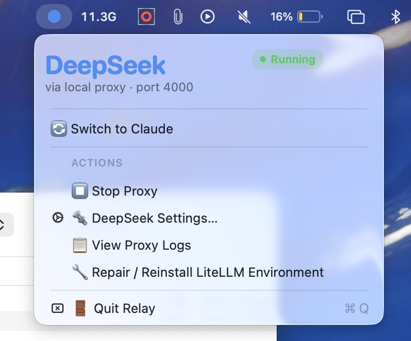
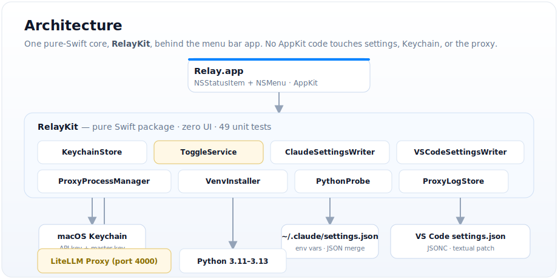

# Relay

A macOS menu bar toggle that routes Claude Code (CLI + VS Code extension) between
your Anthropic claude.ai subscription and DeepSeek API credits through a local
[LiteLLM](https://github.com/BerriAI/litellm) proxy.

One click switches everything. Quit the app and everything reverts.

<p align="center">
  
  &nbsp;&nbsp;
  
</p>

## What it does

- **Switch to DeepSeek** — sets `ANTHROPIC_BASE_URL`/`ANTHROPIC_AUTH_TOKEN` in both
  `~/.claude/settings.json` (CLI) and VS Code's `claudeCode.environmentVariables`
  (extension), starts a local LiteLLM proxy pointed at DeepSeek, and routes all Claude
  Code sessions through it.
- **Switch to Claude** — removes those env vars from both settings files, stops the
  proxy, and your claude.ai subscription takes over immediately with no re-login.
- **Quit** — kills the proxy and reverts routing, so no session points at a dead port
  on next launch.
- **DeepSeek Settings…** — enter your API key and model string (defaults to
  `deepseek/deepseek-v4-pro`). The key lives in your Keychain, not on disk.
- **Repair / Reinstall** — blows away the venv and rebuilds it from scratch if
  something goes wrong with a Python upgrade.
- **View Proxy Logs** — tail the LiteLLM process output in a window.

The menu bar icon turns blue (DeepSeek) or coral (Claude) so the current routing is
visible without opening the menu.

## How it works

Relay runs a [LiteLLM proxy](https://docs.litellm.ai/docs/proxy/quick_start) in a
private Python venv at `~/Library/Application Support/Relay/venv`. The proxy listens
on `127.0.0.1:4000` and translates Anthropic's `/v1/messages` API to DeepSeek's
OpenAI-compatible API using LiteLLM's wildcard model routing (`model_name: "*"`).

Claude Code reads `ANTHROPIC_BASE_URL`/`ANTHROPIC_AUTH_TOKEN` at startup and routes
all requests through whatever they point at. Setting them to the proxy's address —
and unsetting them to revert — is the entire mechanism. Your claude.ai login stays
saved and untouched throughout.

The two surfaces need separate writes because they're independent mechanisms
(confirmed from Anthropic's current docs):

| Surface | Setting | File |
|---|---|---|
| CLI (`claude` in terminal) | `env.ANTHROPIC_BASE_URL` / `env.ANTHROPIC_AUTH_TOKEN` | `~/.claude/settings.json` |
| VS Code extension | `claudeCode.environmentVariables` | `~/Library/Application Support/Code/User/settings.json` |

VS Code's settings file is JSONC (hand-edited, may contain comments), so Relay uses a
targeted textual patch for that file rather than a full parse+rewrite that would
silently eat comments. Claude's settings file gets a full JSON merge — it's strict
JSON with no comments.

### Proxy lifecycle

- **Start**: creates the venv on first use (`pip install litellm[proxy]`), writes
  `litellm-config.yaml`, starts the process, and waits for the `/health/liveliness`
  endpoint to respond before the UI shows "Running."
- **Stop**: `SIGTERM`, then `SIGKILL` after 2 seconds if it hasn't exited.
- **App relaunch reconciliation**: pidfile + `proc_pidpath` (rules out PID reuse) +
  health check (rules out port squatting). If a proxy is already running and healthy,
  it's adopted without restarting.

### Python version selection

Relay probes for a usable `python3` and prefers versions within the known PyPI wheel
range (3.11–3.13) before falling back to newer versions, because litellm's `orjson`
dependency builds via Rust/PyO3 and routinely fails against bleeding-edge Python
releases like 3.14.

## Install

Requires macOS 13+ and a working `python3` (3.9–3.13 recommended). Build from source:

```bash
git clone https://github.com/gokulmc/relay.git
cd relay
./setup-signing.sh   # once — creates a stable local signing identity
./build.sh            # builds, signs, installs to /Applications, launches
```

Re-run `./build.sh` any time you change the code.

### Why `setup-signing.sh`?

`build.sh` needs a stable code-signing identity to reuse across rebuilds. Without one,
it falls back to ad-hoc (`-`) signing, and every rebuild looks like a "different app"
to macOS — which means re-triggering Keychain permission prompts every time. The script
creates and trusts a local identity (`RelayLocalSign`) once, scoped entirely to your
login keychain (no sudo, no system-wide changes).

## Caveats

- **Already-open sessions won't see the toggle** until restarted — Claude Code reads
  these env vars at startup. The app shows a reminder after every toggle.
- **Not sandboxed.** Managing subprocesses and writing to dotfile config paths both
  require running outside the App Sandbox, so this is a local, non-notarized build with
  no App Store distribution planned.
- **Your DeepSeek API key is stored in your login Keychain** (`com.gokul.relay.
  deepseek-api-key`), accessed only by Relay. The LiteLLM master key is generated on
  first launch with `SecRandomCopyBytes` and stored the same way.
- **Anthropic does not endorse, maintain, or support routing Claude Code to non-Claude
  models through any gateway.** This is a personal-use tool built against documented,
  supported environment variables. If a Claude Code update changes how those vars work,
  Relay will need to follow.

## Architecture

<p align="center">
  <a href="docs/architecture.svg"></a>
</p>

**RelayKit** is a pure Swift package (zero AppKit imports) behind the menu bar app.
All logic — Keychain access, settings-file mutation, venv management, proxy lifecycle —
lives here and is independently unit-tested.

## License

[MIT](LICENSE)
